# time-series-forecasting 

This repository contains some projects on time series forecasting.

## 1. Hourly Vehicle Collision (Machine Learning Regression Models)

### 1A. Data Information: [open.canada.ca](https://open.canada.ca/data/en/dataset/1eb9eba7-71d1-4b30-9fb1-30cbdab7e63a)

### 1B. Time Series Plot
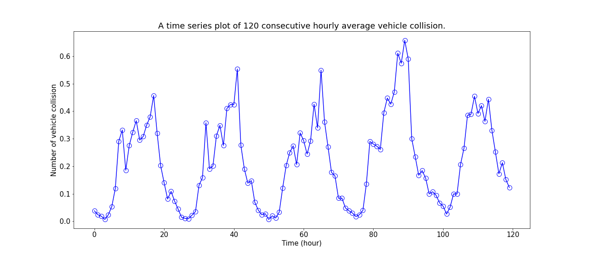

### 1C. Forecasting on the Test Set
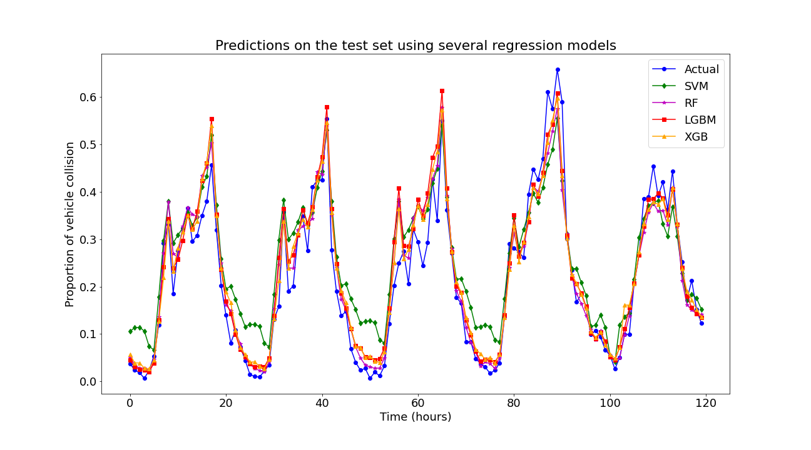

### 1D. Model Diagnostics Plots on the Test Set
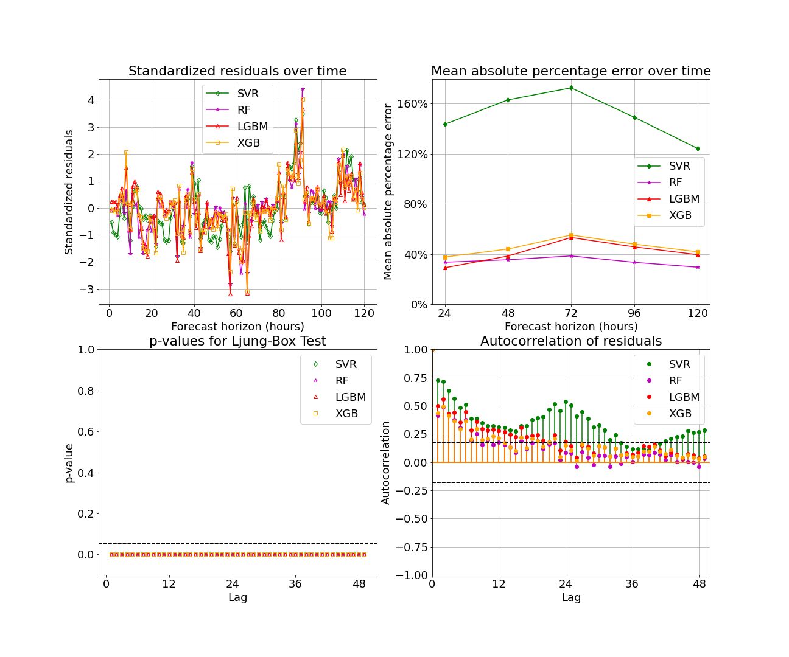

## 2. Monthly Vehicle Fatality (FaceBook Prophet)

### 2A. Data Information: [open.canada.ca](https://open.canada.ca/data/en/dataset/1eb9eba7-71d1-4b30-9fb1-30cbdab7e63a)

### 2B. Time Series Plot
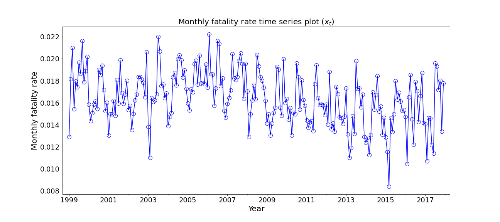

### 2C. Forecasting on the Test Set
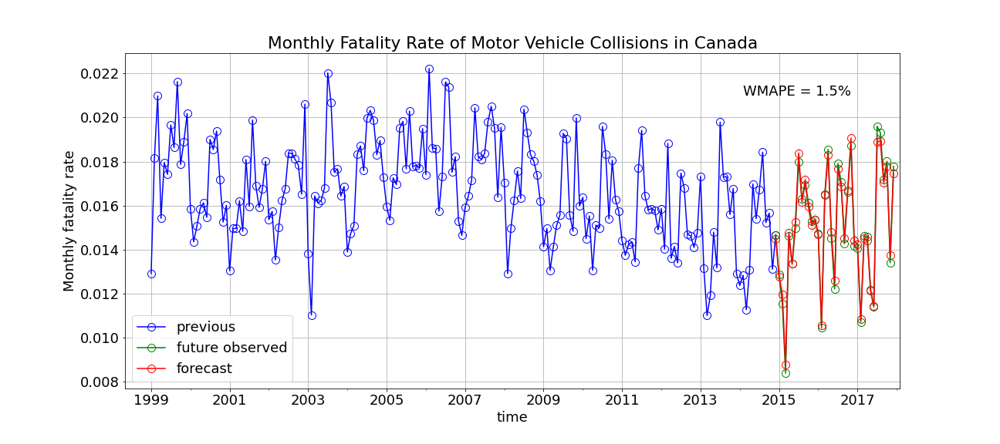

### 2D. Model Diagnostics Plots on the Test Set
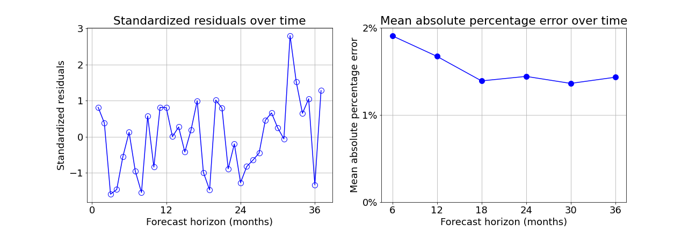
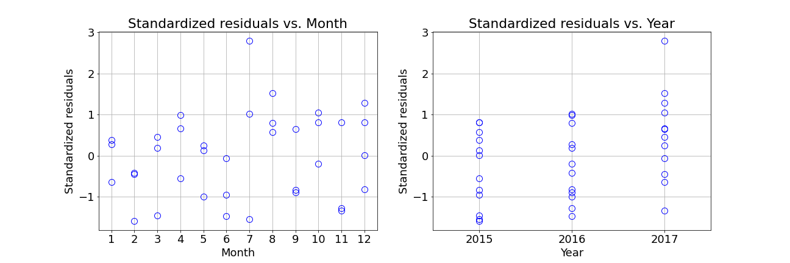

### 2E. Ljung-Box Test
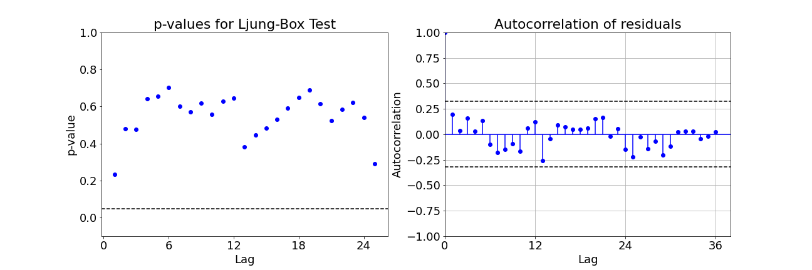

## 3. Sales Forecasting (ARIMA)

### 3A. Time Series Plot
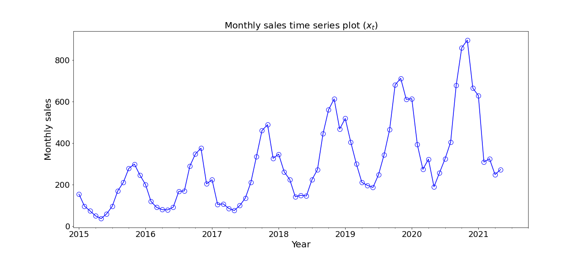

### 3B. Forecasting on the Test Set
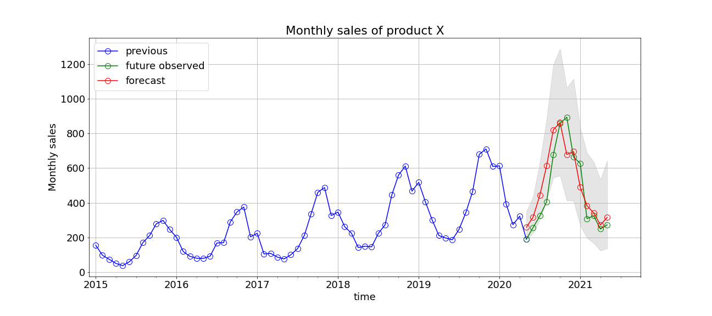

### 3C. Model Diagnostics Plots on the Test Set
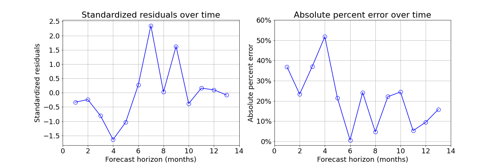

### 3D. Ljung-Box Test
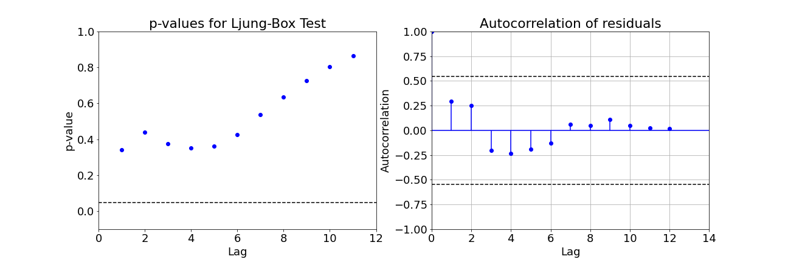

### 3E. Future Forecasts
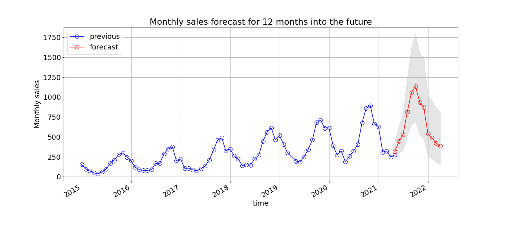

# time-series

# time-series

